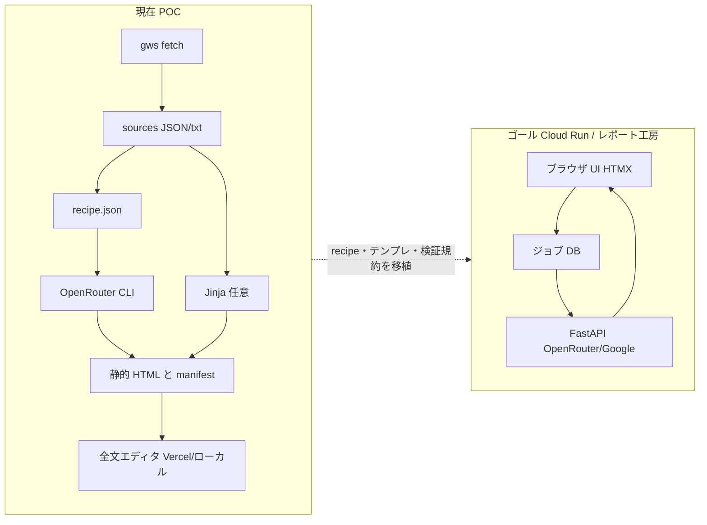

# 月次レポート自動生成の北極星（ぶれない方針）

## 位置づけ

| 項目 | 内容 |
|------|------|
| 正本種別 | **戦略・アーキテクチャ**：「最終どこへ向かうか」と「現行 POC をどう接続するか」 |
| 読者 | 実装・ドキュメント・エージェント（本リポで月次自動化に触れる全員） |
| 詳細フェーズ設計 | [development-plan.md](development-plan.md)・[requirements.md](requirements.md) |
| 運用ワークフロー（gws / 静的エディタ） | [agents.md](../../agents.md)・[fixtures/report_recipes](../samples/monthly-reports/fixtures/report_recipes/README.md)・スキル `monthly-report-new-household-gws` |
| **最終更新** | 2026-05-14 |

---

## 1. 北極星（North Star）

**ブラウザ上で、塾担当者が一次ソースから月次 Pattern B レポートを自動生成し、プレビュー・推敲したうえで配布できる。**

「エディタで手で貼るだけ」でもない。「ローカル Python を毎回想い出す」でもない。**サービス側で取込・生成・ログ・再利用**ができる状態をゴールとする。

---

## 2. 達成しないと“方針がぶれた”となること（非交渉）

以下は **`agents.md`** およびワークショップ各仕様書と矛盾させない。

1. **API 鍵・生 PII はブラウザに置かない**（OpenRouter／Google／暗号鍵はサーバー／Secret 側）。
2. **本文・データ契約の正本は** `docs/samples/monthly-reports/monthly_pattern_b_content.template.md` **および関連 DATA_CONTRACT**。生成物やモック HTML がぶれたら **規約側を正**とする。
3. **家庭向け文体の正本セット**：[family-facing-tone.md](../../.cursor/skills/monthly-report-notebooklm-patterns/references/family-facing-tone.md) とテンプレ内「ご家庭配布での表記ルール」をセットで守る。
4. **レイアウトばらつきの抑止**：LLM に「白紙 DOM のみ」させない。現行 POC では次のどちらかを明示する。
   - **シェル固定**: `ideal_html` + `structure-from-ideal`（＋既定の OpenRouter HTML 規約）；または将来の検収 HTML。
   - **テンプレ固定**: Jinja シェル + JSON ペイロード（`render_monthly_report_payload.py` のライン）。LLM は主にペイロード文字列のみ。
5. **再現可能性**：生成条件は **`*.recipe.json` +（将来）サーバ側 `prompt_version` / モデル固定** で再実行できる形に収める（完全な bitwise 同一はモデル依存で保証しないが、条件は保存する）。
6. **ログ・生成物・ソーススナップショット**をチューニングと変更追跡のために保存する設計とする（MVP で必須、[`agents.md`](../../agents.md)）。

---

## 3. 三層アーキテクチャ（迷ったときの見取り図）

| 層 | 状態 | 役割 |
|----|------|------|
| **A. コンテンツ正本** | 常時 | `monthly_pattern_b_content.template.md`、DATA_CONTRACT、family-facing-tone |
| **B. 生成パイプライン実体** | 移行中 | いま：**`monthly_report_draft_openrouter.py`** + **`monthly_report_run_recipe.py`** + **`report_recipes/*.recipe.json`**。将来：**ジョブ + サーバー上の同名規約**。 |
| **C. UX** | 移行中 | いま：静的 **`monthly_report_full_editor.html`**。将来：**工房内蔵エディタ**（D-011 準拠） |

「POC と別物を増やさない」のではなく、**同じ規約・同じパラメータ表現を工房側へ持ち上げる**ことを正とする。

---

## 4. 現在の運用チェックリスト（エージェント／人間共通）

### 静的デモ・単発生成で迷わないために

1. 一次ソース取得は **`scripts/fetch_monthly_gws_sources.py`**（PowerShell のみでの JSON 保存禁止）。
2. HTML を十倉系シェルに揃えるなら **`--ideal-html`** + **`--structure-from-ideal`** をレシピに含める。
3. 条件固定は **`fixtures/report_recipes/*.recipe.json`** に書き、`monthly_report_run_recipe.py` で実行する。
4. エディタ・本番への載せ替えは **`reports-manifest.json` revision** + **`sync_monthly_reports_to_vercel.mjs`** + **`vercel.json`**（静的ルート）。
5. 新しく「レイアウトだけ別ルート」を増やす場合は、この文書 §2 に照らし**シェル固定かペイロード固定か**を decision-log に残す。

### 将来的にブラウザ完結へ

- 本リポの **`docs/monthly-report-workshop/`** の API・ジョブ・データ設計書に従う。
- POC の **`recipe`** の概念は、工房側の **`job params` / reproducibility bundle** に相当させる（別名だけ増やして中身が分岐しないようにする）。

---

## 5. 関連リンク

| 文書／資産 |
|------------|
| [agents.md](../../agents.md) |
| [fixtures/report_recipes/README.md](../samples/monthly-reports/fixtures/report_recipes/README.md) |
| [.cursor/rules/monthly-report-north-star.mdc](../../.cursor/rules/monthly-report-north-star.mdc) |
| スキル `monthly-report-new-household-gws`、`monthly-report-notebooklm-patterns` |
| [llm-design.md](llm-design.md)、[functional-spec.md](functional-spec.md) |

---

## 6. 改訂

方針の変更・例外は **[decision-log.md](decision-log.md)** に ID を付けて記載し、この文書の「非交渉」セクションとの整合を取ること。
