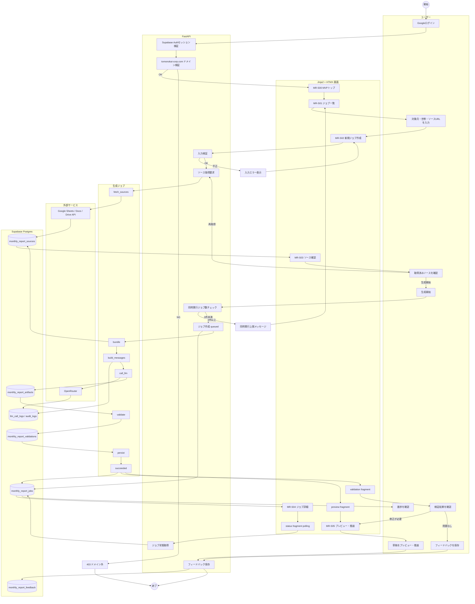
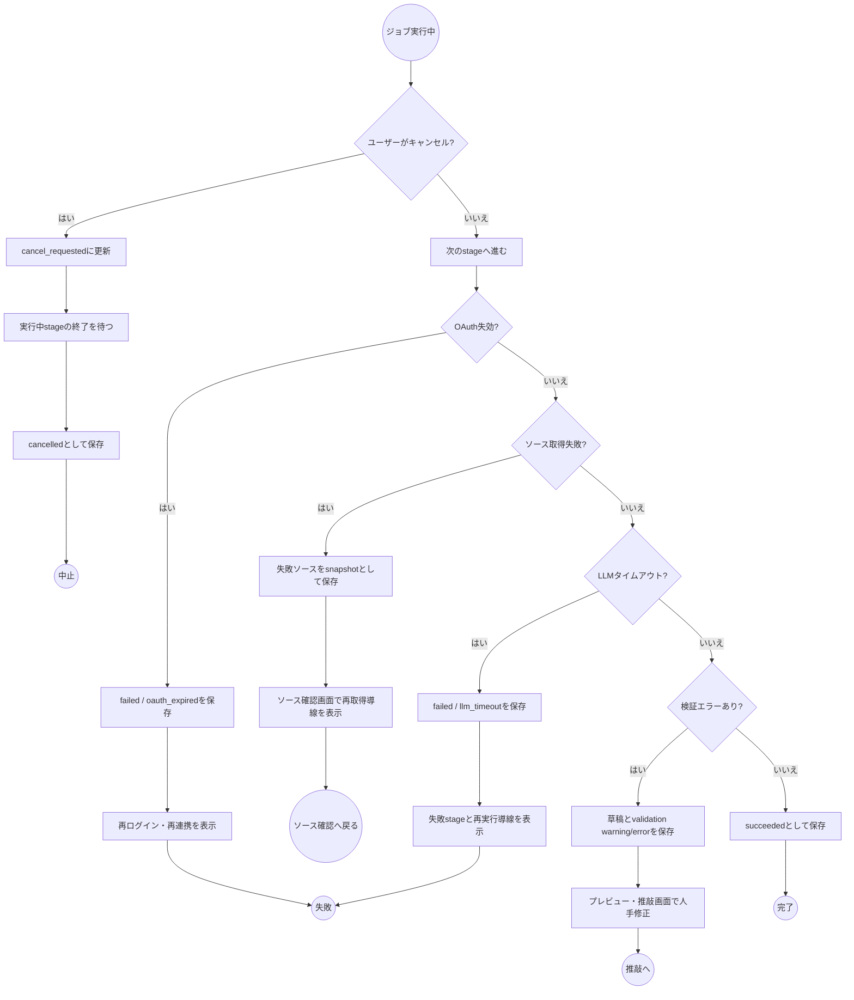

# アクティビティ図

## 位置づけ

- 正本/補助資料の区分: 月次レポート作成ツールの業務・画面・API横断フロー補助資料
- 起点: `docs/project/月次レポート_プログラム化_LLMワークフロー移行計画.md`
- 関連文書: `workflow-spec.md`, `functional-spec.md`, `screen-design.md`, `api-definition.md`, `data-design.md`
- 最終更新: 2026-05-14

## 決定事項

- MVPはFastAPI + Jinja2 + HTMXで実装し、長時間生成はDBジョブ + HTMXポーリングで扱う。
- Sheets / Docs / DriveはユーザーOAuthでサーバ取得する。
- 生成パイプラインは `fetch_sources` → `bundle` → `build_messages` → `call_llm` → `validate` → `persist` の段階で扱う。
- 検証エラーはMVPでは自動repair loopへ送らず、草稿・検証結果・フィードバックを保存して人手の推敲へ戻す。

## 標準アクティビティ

## 例外・分岐アクティビティ

## 画面遷移との対応

| アクティビティ | 画面 | API / fragment | 主な保存先 |
|---|---|---|---|
| ログイン・ドメイン検証 | ログイン / 403 | 認証基盤側 | `audit_logs` |
| 新規ジョブ入力 | MR-S02 | `POST /api/monthly-reports/jobs` | `monthly_report_jobs` |
| ソース取得・確認 | MR-S03 | 後続実装 | `monthly_report_sources` |
| 進捗確認 | MR-S04 | `GET /monthly-reports/jobs/{job_id}/fragments/status` | `monthly_report_jobs` |
| 草稿表示 | MR-S05 | `GET /monthly-reports/jobs/{job_id}/fragments/preview` | `monthly_report_artifacts` |
| 検証結果表示 | MR-S04 / MR-S05 | `GET /monthly-reports/jobs/{job_id}/fragments/validation` | `monthly_report_validations` |
| フィードバック保存 | MR-S05 | `POST /api/monthly-reports/jobs/{job_id}/feedback` または fragment POST | `monthly_report_feedback` |

## 未決事項

なし。ソース確認APIの詳細は `api-definition.md` の今後の拡張で具体化する。

## 受け入れ条件

- 標準フローが `workflow-spec.md` の login から feedback までを表現している。
- ユーザー、画面、API、ジョブ、外部サービス、DBの責務境界が読める。
- 429、OAuth失効、ソース取得失敗、LLMタイムアウト、検証エラー、キャンセルの例外分岐がある。

## 改訂履歴

| 日付 | 内容 |
|---|---|
| 2026-05-14 | 初版作成 |
