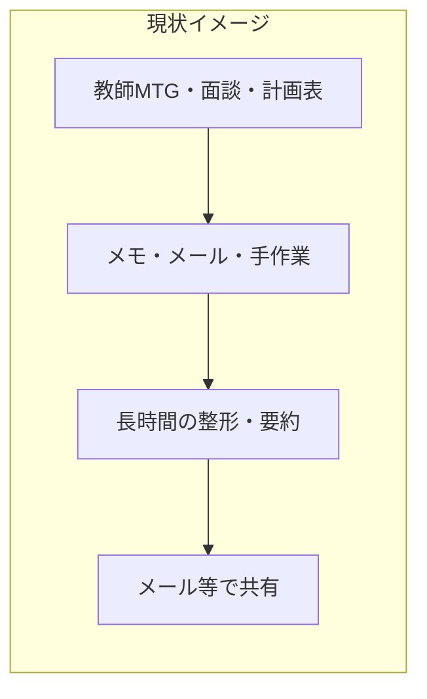
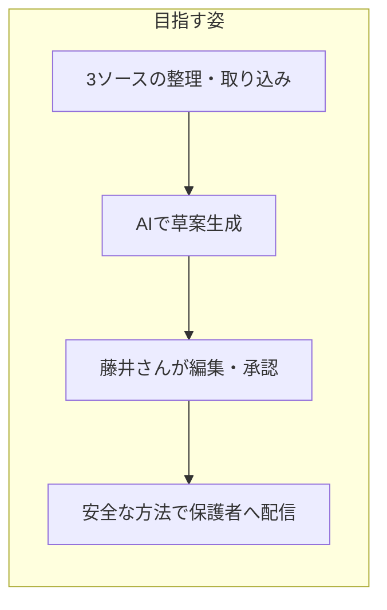
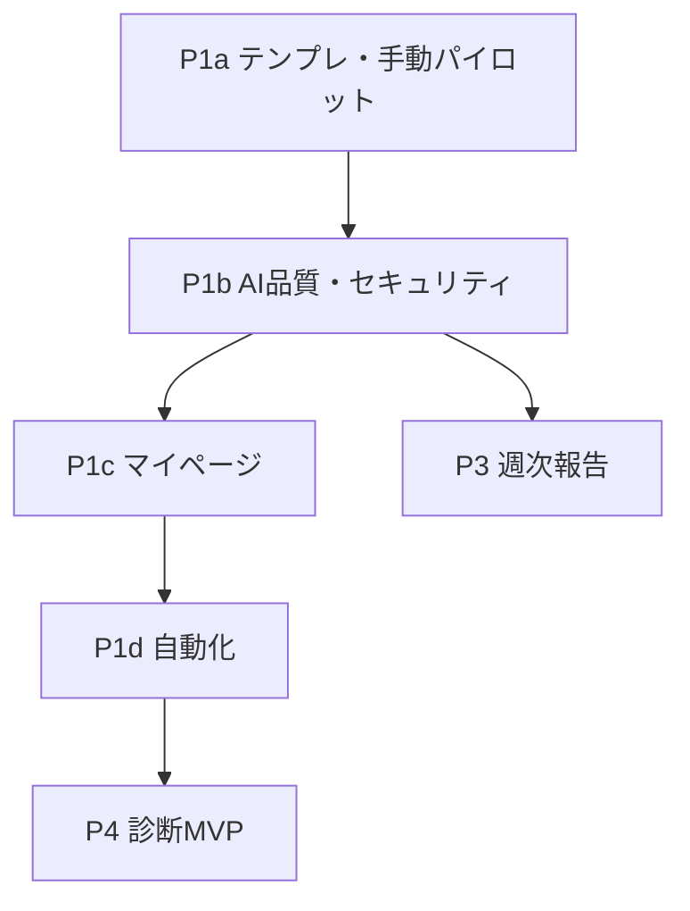

# 面談ビュー＆レポート標準化プロジェクト — 全体像（共有用）

**文書の目的**: 関係者がプロジェクトの目的・進め方・マイルストーンを短時間で把握できるようにする。  
**正本**: [面談学習計画レポート標準化_PJC.md](面談学習計画レポート標準化_PJC.md) / [面談学習計画レポート標準化_WBS.md](面談学習計画レポート標準化_WBS.md)  
**更新日**: 2026-04-09

---

## 1. プロジェクトの全体像（一言）

エデュバルアカデミーにおいて、**教師MTG・家庭面談・学習計画を根拠にした月次レポート**を、**テンプレ標準化 → AI支援 → 編集・承認 → 安全な配信 → 自動取り込み**の順で実現し、**工数削減・品質安定・顧客価値（アップセル・離脱防止）**を同時に高めるプロジェクトです。

---

## 2. 体制（who）

| 役割 | 担当 | 主な責務 |
|------|------|----------|
| 開発主体・PM | 原口 | システム開発、AI連携、レポートテンプレ、WBS管理 |
| 面談実施・品質確認 | 藤井 | 教師MTG・家庭面談の実施、レポート品質レビュー・修正 |
| 現場責任者 | 元山 | 業務フロー決定、運用ルール承認、教師マネジメント |

---

## 3. 全体の目的とゴール

### 3本柱（ビジネス目的）

1. **アップセル促進** — レポート・面談の接触回数と質を高め、追加契約につなげる  
2. **離脱防止** — 月次ルーチンで定期的な接触を確保し、契約継続率を上げる  
3. **業務標準化** — 型化・自動化で属人性を減らし、再現可能な運用にする  

### 定量目標（イメージ）

| 指標 | 現状（目安） | 目標（方向性） |
|------|--------------|----------------|
| レポート作成時間 | 4〜6時間／件 | 約30分／件（編集中心） |
| AI生成レポートの修正負荷 | 高い（大幅修正が常態化） | 修正率 **20%以下** を目安に安定化 |

### 親プロジェクト完了のイメージ（卒業条件の要約）

- **月次レポートの一連パイプライン**（取り込み→生成→編集→配信）が実運用で回る  
- **週次指導報告の自動化**（P3）が設計・実証に入る  
- **品質基準**が言語化され、AI出力の修正率が目標水準で安定  
- **未決事項**（法務・権限・SLA 等）がオーナー付きで棚卸しされる  

---

## 4. 現在の課題（AsIs）

- **工数**: 面談準備・レポート化に **4〜6時間／件**かかり、上期の最大ボトルネックになりやすい  
- **属人性**: 面談メモ・体裁がバラつき、テンプレとツールが分散  
- **顧客コミュニケーション**: **メール中心**で、構造化レポートほどの訴求・追跡がしづらい  
- **AI要約の品質**: 品質定義が言語化されておらず、**藤井さんによる大幅修正**が続きやすい  
- **データ・運用**: 模試・答案・日程などの共有遅延、週次報告の手作業、命名規則のばらつきなど  
- **法務・権限**: 録画・文字起こしの保存・同意は合意が必要（段階導入）  

---

## 5. ワークフロー：現在（AsIs）と理想（ToBe）

### 5.1 月次レポートの「正」とする一次情報（3ソース）

保護者向け月次レポートは、原則として次の **3つの情報** を根拠にします（メール本文だけを根拠にしない）。

| ソース | 内容 |
|--------|------|
| 教師MTG記録 | 要約・文字起こし |
| 家庭面談記録 | 面談の記録 |
| 学習計画表 | 最新スナップショット（数値・目標の「正」はここを優先） |

### 5.2 現在の流れ（概念）

### 5.3 目指す流れ（ToBe：段階的に近づける）

- **P1a（今）**: テンプレ確定と **手動で1件** ご家庭へ届け、フィードバックを得る（配信は **簡易方式**）  
- **P1b以降**: AI生成の品質検証と、**本番向けのセキュア配信（ワンタイムURL等）** を整備  

---

## 6. 子プロジェクト（フェーズ）ごとの目的・ゴール・成果物

制作の流れに沿った **6つのブロック** と、横串のガバナンスです。

| Phase | 名称 | 目的 | ゴール（完了のイメージ） | 主な成果物 |
|-------|------|------|---------------------------|------------|
| **P1a** | テンプレ決定・手動パイロット | 最速で「ご家庭に届く」体験とフィードバックを得る | テンプレ1つに確定し、実データ1件を配信して反応を得る | 採用HTMLテンプレ、手動レポート1件、フィードバック記録 |
| **P1b** | AI生成＋品質検証／セキュリティ | AIで草案を作り「送れる品質」を測る／安全に届ける基盤を作る | 修正率目標を満たす検証＋ワンタイムURL等の基盤 | プロンプト、品質チェック、認証・閲覧・DB設計 |
| **P1c** | マイページ | 社内とご家庭で、編集から送信までを画面で完結させる | 管理画面＋ご家庭ビューで運用可能 | 一覧・編集・承認・送信、過去閲覧、手動アップロード |
| **P1d** | 配信自動化＋取り込み自動化 | 件数が増えても破綻しない運用にする | 自動取り込み＋メール自動配信が安定 | Drive連携、命名規則運用、配信ログ等 |
| **P3** | 週次指導報告の自動化 | 週次の報告をルーチン化し離脱防止に寄与 | 週次報告の自動送付が回る | P1bエンジン流用、対象範囲の合意 |
| **P4** | 無料見積もり診断（後段） | データ蓄積を活かし新規導線を作る | MVPが1件動く | 診断フロー、レポート試作 |

**横串（全フェーズ）**: 品質定義、法務・権限、未決事項のオーナー管理  

### フェーズ依存関係（概要）

※ P4 は P1/P3 のデータ蓄積を見ながら後段で着手。

---

## 7. AI・セキュリティの方針（要約）

| 項目 | 内容 |
|------|------|
| AI（段階的） | まず **Gemini 単体**で3ソースから生成・品質検証 → 必要に応じ **File Search** で時系列・蓄積へ |
| パイロット配信（P1a） | **簡易方式**（Drive限定共有 or 簡易パスワード）。最速フィードバック優先 |
| 本番寄り（P1b〜） | **ワンタイムURL** 等、要件定義（T1-3）に沿った配信 |

---

## 8. 全体マイルストーン（M1〜M8）

| # | マイルストーン | Phase | 完了基準 | 目標時期 |
|---|---------------|-------|----------|----------|
| M1 | テンプレ確定 | P1a | 4パターンから1つに確定、関係者合意 | 2026-04-16 |
| M2 | 手動パイロット配信 | P1a | 実データ1件をご家庭に配信しフィードバック取得 | 2026-04-末 |
| M3 | AI生成品質合格 | P1b | AI生成→藤井さん修正率20%以下を3件以上で達成 | 2026-05-末 |
| M4 | セキュリティ基盤完成 | P1b | ワンタイムURL認証・閲覧・DBが揃う | 2026-06-中 |
| M5 | マイページリリース | P1c | 社内＋ご家庭で編集〜送信が画面完結 | 2026-07-中 |
| M6 | 自動化パイプライン稼働 | P1d | 自動取り込み＋メール自動配信が月10件規模で安定 | 2026-08-末 |
| M7 | 週次報告自動化 | P3 | 週次報告が自動送付される状態 | 2026-09-末 |
| M8 | 診断サービスMVP | P4 | 答案→AI分析レポート無料提供が1件稼働 | 下期 |

**進捗メモ（抜粋）**: 2026-04-02 要件定義・セキュリティ要件（T1-3）完了／2026-04-09 フェーズ再構成・HTMLテンプレ4種試作完了  

---

## 9. スコープ外（当面）

- 三者面談の新規プロセス立ち上げ（別扱い）  
- 教材・教師連携の大型立ち上げ、採点システム本体（別プロジェクト）  

---

## 10. 関連ドキュメント

- **スプレッドシート（全体像・装飾済み）**: [面談レポート標準化_プロジェクト全体像_2026-04-09](https://docs.google.com/spreadsheets/d/1D76UWfc0xYzWuK_Lz5c3K2yHnahJ3ZQdf8fscWavLZ8/edit) — `gws` で `docs/project/プロジェクト全体像_共有用.md` 相当を8シートに分割して反映（再生成は `node scripts/project_overview_to_sheet.mjs`）  
- [面談学習計画レポート標準化_PJC.md](面談学習計画レポート標準化_PJC.md) — 親PJC（詳細）  
- [P1a_テンプレ決定・手動パイロット_PJC.md](P1a_テンプレ決定・手動パイロット_PJC.md) — 現在の子PJC  
- [月次レポート生成ワークフロー.md](月次レポート生成ワークフロー.md) — 3ソース運用の手順  
- [プロジェクト計画_全体概要.md](プロジェクト計画_全体概要.md) — 計画・リスクの補足  

---

## 11. スライド化（推奨: Marp／参考: NotebookLM）

### 推奨: Marp（日本語・体裁を自分で固定）

NotebookLM スタジオの自動スライドは、**英語寄りのタイトル・本文**や**汎用画像**になりやすく、社内向けの説明資料としては不十分なことがある。**日本語・レイアウト・画像なし**を優先する場合は **slide-composer（Marp）** スキルに沿い、次のファイルから PDF/HTML を出力する。

| 項目 | 内容 |
|------|------|
| 原稿 | [プロジェクト全体像_共有用_slides.md](プロジェクト全体像_共有用_slides.md)（`marp: true`、本文は日本語・装飾画像なし） |
| PDF 出力例 | リポジトリ直下で `npx @marp-team/marp-cli docs/project/プロジェクト全体像_共有用_slides.md --pdf -o docs/project/プロジェクト全体像_共有用_slides.pdf` |

### 参考: NotebookLM（自動生成・品質は読み物向き）

前回の自動生成は **notebooklm-mcp** の `studio_create`（`artifact_type: slide_deck`）のみ使用。**slide-composer は未使用**。スタジオは仕様上、言語・ビジュアルを細かく制御しにくい。

| 項目 | 値 |
|------|-----|
| 専用ノート | https://notebooklm.google.com/notebook/091e4093-8c3e-41f2-a887-3ade7b73da2a |
| 既存ノート（ソース多） | https://notebooklm.google.com/notebook/8d0e1e72-2137-485e-a524-826ba11d359c |

**運用メモ（notebooklm-mcp）**: `artifact_type` は `slide_deck`。完了確認は `studio_status`。社外向け・体裁重視のスライドは **Marp 原稿を正**とし、NotebookLM は叩き台・社内メモ用途に留めるのが無難。
