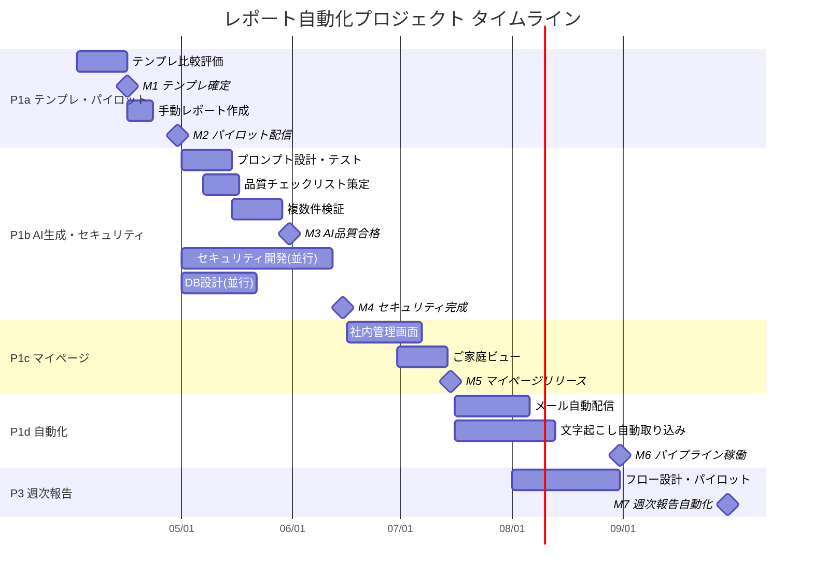

# プロジェクト計画：全体概要

## プロジェクト背景
エデュバルアカデミーでは、教師ミーティング後のレポート作成に4-6時間/件かかるなど、業務の属人化と非効率性が課題となっている。AI要約の品質が低く、大幅な修正が必要な状態が続いている。また、保護者への情報提供がメール中心で、時系列での変化が伝わりにくいという問題もある。

## プロジェクト目的
1. **業務効率化**: レポート作成時間を4-6時間/件から30分/件に短縮
2. **品質向上**: AI生成レポートの修正率を80%から20%以下に改善
3. **顧客価値向上**: 時系列での学習進捗を視覚的に伝えるレポートの提供
4. **標準化**: 属人性の排除と業務プロセスの再現性確保

## プロジェクト範囲

### 含まれるもの

| Phase | 内容 |
|-------|------|
| P1a | テンプレ決定・手動パイロット（実データ1件→保護者配信） |
| P1b | AI生成＋品質検証 / セキュリティ開発（ワンタイムURL認証） |
| P1c | マイページ開発（社内管理画面＋ご家庭ビュー） |
| P1d | 配信自動化＋文字起こし自動取り込み |
| P3 | 週次指導報告の自動化（P1bエンジン流用） |
| P4 | 無料見積もり診断サービス（後段） |
| 横串 | 品質定義・法務確認・未決事項管理 |

### 含まれないもの
1. カリキュラム管理システムの全面再構築（別プロジェクト）
2. 採点システム（別プロジェクト）
3. 教師向けモバイルアプリの開発
4. 三者面談の新規スコープ

---

## プロジェクトフェーズ・マイルストーン

### 全体マイルストーン一覧

| # | マイルストーン | Phase | 完了基準 | 目標時期 |
|---|---------------|-------|----------|----------|
| M1 | テンプレ確定 | P1a | 4パターンから1つに確定、関係者合意 | 2026-04-16 |
| M2 | 手動パイロット配信 | P1a | 実データ1件のレポートをご家庭に配信しフィードバック取得 | 2026-04-末 |
| M3 | AI生成品質合格 | P1b | AI生成→藤井さん修正率20%以下を3件以上で達成 | 2026-05-末 |
| M4 | セキュリティ基盤完成 | P1b | ワンタイムURL認証バックエンド・閲覧ページ・DB完成 | 2026-06-中 |
| M5 | マイページリリース | P1c | 社内管理画面＋ご家庭ビューで編集〜送信が画面完結 | 2026-07-中 |
| M6 | 自動化パイプライン稼働 | P1d | 文字起こし自動取り込み＋メール自動配信が10件/月で安定稼働 | 2026-08-末 |
| M7 | 週次報告自動化 | P3 | P1bエンジン流用で週次報告が全自動送付される状態 | 2026-09-末 |
| M8 | 診断サービスMVP | P4 | 答案→AI分析レポート無料提供の仕組みが1件稼働 | 下期 |

### P1a: テンプレ決定・手動パイロット（〜2026年4月末）
**目標**: 実データ1件を保護者に最速で届けてフィードバックを得る  
**セキュリティ**: 簡易方式（Drive限定共有 or 簡易パスワードページ）  
**詳細**: [P1a子PJC](P1a_テンプレ決定・手動パイロット_PJC.md)

### P1b: AI生成＋品質検証 / セキュリティ開発（〜2026年6月中）
**目標**: AI生成→藤井さん手直し→送れる品質の検証。並行してセキュリティ基盤開発  
**AI方針**: Gemini単体で3ソースからレポート生成。品質合格後にFile Search設計を準備

### P1c: マイページ開発（〜2026年7月中）
**目標**: 社内管理画面＋ご家庭ビューで編集〜送信が画面完結

### P1d: 配信自動化＋取り込み自動化（〜2026年8月末）
**目標**: 10件以上でも破綻しない仕組み

### P3: 週次指導報告の自動化（〜2026年9月末）
**目標**: P1bのエンジンを流用し週次報告を全自動化

### P4: 無料見積もり診断サービス（下期）
**目標**: P1/P3のデータ蓄積を活用した診断サービスMVP

---

## 主要成果物

### ドキュメント類
1. **要件定義書**: レポート自動化システムの機能・非機能要件
2. **技術設計書**: システムアーキテクチャ、データベース設計、API仕様
3. **テスト計画書**: 単体テスト・結合テスト・ユーザビリティテスト計画
4. **運用マニュアル**: システム運用・保守手順書

### システム類
1. **レポート自動生成エンジン**: AIを活用したレポート生成コア
2. **管理画面**: レポート編集・承認・送信機能
3. **自動取り込みモジュール**: Google Driveからのファイル取得・処理
4. **認証・セキュリティモジュール**: 認証コード方式のアクセス制御

### プロセス類
1. **教師ミーティング標準アジェンダ**: 30分で完了する議事進行表
2. **品質チェックリスト**: AI生成レポートの品質評価基準
3. **命名規則ガイド**: ファイル命名の統一ルール
4. **トレーニング資料**: 教師・スタッフ向け説明資料

---

## タイムライン（概略）

---

## リスク管理

### 技術的リスク
| リスク | 影響度 | 発生確率 | 対策 |
|--------|--------|----------|------|
| AI生成品質が期待に満たない | 高 | 中 | 段階的導入、人間編集ワークフローの確保、プロンプトの継続的改善 |
| Google Drive API制限 | 中 | 低 | レート制限対策、バッチ処理の最適化、代替手段の検討 |
| セキュリティ要件の厳格化 | 中 | 中 | 早期のセキュリティ担当者との協議、段階的導入 |

### 業務的リスク
| リスク | 影響度 | 発生確率 | 対策 |
|--------|--------|----------|------|
| 教師の協力が得られない | 高 | 中 | インセンティブ設計、ルールの簡素化、トレーニングの実施 |
| 既存業務フローとの摩擦 | 中 | 高 | 段階的導入、関係者への丁寧な説明、フィードバックループの設置 |
| データ品質の問題 | 高 | 中 | 入力バリデーションの強化、エラーハンドリングの充実 |

### スケジュールリスク
| リスク | 影響度 | 発生確率 | 対策 |
|--------|--------|----------|------|
| 開発リソース不足 | 高 | 高 | 優先順位の明確化、外部リソースの検討、スコープの調整 |
| 要件変更の頻発 | 中 | 中 | アジャイル開発の採用、スプリントレビューの定例化 |

---

## 必要なリソース

### 人的リソース
| 役割 | 担当 | 主な責務 | 確保状況 |
|------|------|----------|----------|
| 開発主体・PM | 原口 | システム開発全般、AI連携、WBS管理 | 確保済み |
| 面談実施・品質確認 | 藤井 | レポート品質レビュー・修正、ご家庭対応 | 確保済み |
| 現場責任者 | 元山 | 業務フロー決定、運用ルール承認、教師マネジメント | 確保済み |
| 法務 | 未定 | 個人情報・録画・文字起こしの法務確認 | 要確保 |

### 技術的リソース
| リソース | 仕様 | 用途 | 確保状況 |
|----------|------|------|----------|
| AI API | Gemini | レポート自動生成 | 確保済み |
| データベース | 要検討（P1bで決定） | 生徒・レポート・トークン管理 | 要確保 |
| メール送信サービス | SendGrid等（P1dで導入） | レポート配信 | 要確保 |
| ホスティング | 要検討 | 管理画面・閲覧ページ | 要確保 |

---

## 次のステップ

### 今週〜4/16（P1a前半）
1. **テンプレ比較評価**: 4パターン（A〜D）の比較評価→推奨案決定
2. **M1 テンプレ確定**: 原口・藤井・元山で合意

### 4月後半（P1a後半）
1. **素材収集**: 藤井さんの直近面談1件の3ソースを手動収集
2. **手動レポート作成**: 確定テンプレに実データを流し込み
3. **品質レビュー**: 藤井さん判定→修正
4. **M2 パイロット配信**: 簡易方式でご家庭に配信→フィードバック

### 5月〜6月（P1b）
1. **AI生成**: Gemini単体でプロンプト設計・品質検証
2. **セキュリティ開発**: ワンタイムURL認証バックエンド
3. **DB設計**: 生徒・レポート・トークンのスキーマ

### 7月以降（P1c〜）
1. **マイページ開発**: 社内管理画面＋ご家庭ビュー
2. **自動化**: メール配信＋文字起こし取り込み

---

## 関係者一覧

| 役割 | 氏名 | 主な責務 |
|------|------|----------|
| 開発主体・PM | 原口 | システム開発、AI連携、レポートテンプレ、WBS管理 |
| 面談実施・品質確認 | 藤井 | 教師MTG・家庭面談の実施、レポート品質レビュー・修正 |
| 現場責任者 | 元山 | 業務フロー決定、運用ルール承認、教師マネジメント |

---

## 関連ドキュメント
1. [04-02_週次会議_議事録_整理.md](04-02_週次会議_議事録_整理.md)
2. [藤井さんヒアリング_ワークシート.md](藤井さんヒアリング_ワークシート.md)
3. [レポート自動化システム_要件定義.md](レポート自動化システム_要件定義.md)
4. [技術的タスクリスト_アクションアイテム対応.md](技術的タスクリスト_アクションアイテム対応.md)
5. [面談学習計画レポート標準化_PJC.md](面談学習計画レポート標準化_PJC.md)
6. [面談学習計画レポート標準化_WBS.md](面談学習計画レポート標準化_WBS.md)

---

*最終更新: 2026年4月9日*  
*プロジェクトコード: EA-RPT-2026-001*