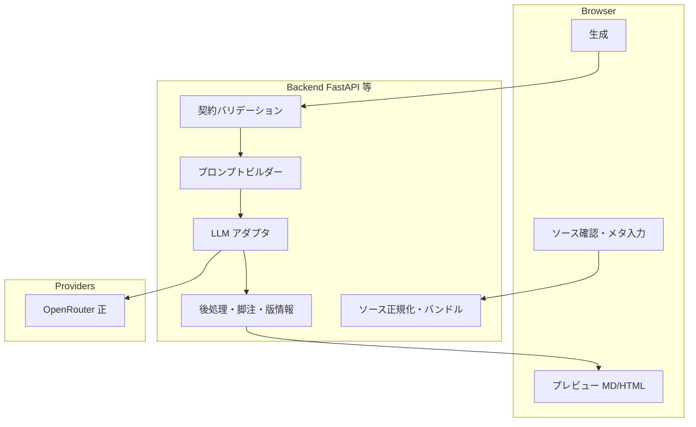

# 月次レポート：プログラム化と LLM ワークフロー移行計画

**開発計画の呼称（合意）**: **月次レポート作成ツール**（別名: **レポート工房**）。スコープは **データソース取込・LLM 生成・規約検証・推敲（プレビュー／エディタ）** を一体とする。「エディタのみ」の開発ではない。

**目的**: 月次レポート作成を「エージェント（チャット）内の暗黙知」から切り離し、**ブラウザでデータソースを読み込み、操作一つでドラフト生成〜推敲まで辿り着ける**形に段階移行する。

**正本（仕様・規約）**: 引き続き `docs/samples/monthly-reports/monthly_pattern_b_content.template.md` と `DATA_CONTRACT_05_学習の進捗.md` ほか既存データ契約を正とする。プログラム化は **規約をコードとテストで強制する側** を増やす。

**更新日**: 2026-05-13（**チューニング志向 MVP**：目的・保存物・運用指針を追記）

### 決定事項（基盤・UI）

- **ランタイム**: Python **FastAPI**。
- **本番ホスティング（アプリ／API）**: **Google Cloud Run**（コンテナ）。スケール・タイムアウト・Secret（`OPENROUTER_*` 等）は Cloud Run の設定で要件化する。
- **画面**: **Jinja2（サーバサイドテンプレート）+ HTMX**。CSR 専用 SPA は採用しない（既存 `eb_app` のモック方針と整合）。進捗ポーリング・ジョブ状態・プレビュー差し替えは **fragment エンドポイント + `hx-*`** で組み立てる。
- **静的資産**: 既存の月次 HTML など **Vercel 静的配信**は当面維持してよい。**境界**は要件で明示する（例: 「レポート工房」は Cloud Run、配布用プレビュー URL は既存経路）。

### 決定事項（MVP：認証・データソース・環境）

- **認証・権限（MVP）**: **Google アカウント**ログインのみ。**メールドメインは `tomonokai-corp.com` に限定**（会社 Workspace と整合させる。実装は OAuth ID トークンの `hd`／メール検証などで要件化）。
- **データソース（MVP）**: **Google Sheets・Google Docs は、ユーザー認証に基づく OAuth（ユーザー委譲）**でサーバが API 取得する（Drive / Sheets / Docs API。**サービスアカウント鍵をブラウザやクライアントに置かない**）。ファイルアップロードによるフォールバックは任意だが、MVP の主経路は「ユーザーがアクセス権を持つスプレッドシート／ドキュメントの指定」。
- **データの永続化**: **ジョブ・取得済みソースのスナップショット・生成成果物（MD 等）は保存する**（再開・監査・再生成のため）。具体的なストア（例: PostgreSQL 互換／**将来の Supabase** との一本化）は実装フェーズで確定するが、**後述のポータル統合を見越し RDB スキーマを持てる構成**を優先する。
- **同時実行制限**: **1 ユーザーあたり同時に走らせられる生成ジョブは最大 3 件**（超過時は 429 またはキュー／明示メッセージで拒否）。
- **デプロイ環境（MVP）**: **staging / production の2環境を用意する**。migration、RLS、Google OAuth、OpenRouter、HTML UI smoke、ライブE2Eはstagingで確認し、productionへ昇格する。Secret・URL・OAuth redirect URI・Supabase project/DB・E2Eデータは環境ごとに分離する。
- **MVP の主目的（チューニング）**: **実運用をしながら**、プロンプト・コンテンツテンプレート・コード・LLM モデルの組み合わせを調整し、**品質向上と失敗／成功パターンの把握**を優先する。**ログ・ファイル（ソーススナップショット・生成物・検証結果）の保存は必須**とし、後から「何が効いた／効かなかったか」を説明できる状態をゴールとする。

### 決定事項（将来統合）

- **指導管理ポータル（別計画・未構築）**: 将来、**FastAPI + Supabase + Jinja2 + HTMX + Cloud Run** のポータルサイトへ **機能マージ**する想定。レポート工房は **ルータ・サービス・テンプレをモジュール境界**で分離し、同一リポジトリ内での統合または同一 Cloud Run サービスへの統合がしやすい形で実装する（MVP は単独デプロイでも可）。

### 決定事項（LLM）

- **当面は OpenRouter 中心で構築する**（キーはサーバ側環境変数 `OPENROUTER_API_KEY`）。
- **モデルの段階利用**: **レポート本文生成**には評判・品質優先で **Claude Sonnet または Opus**（OpenRouter 上の `anthropic/claude-sonnet-4.6`・`anthropic/claude-opus-4.7` 等、実際の ID は [OpenRouter のモデル一覧](https://openrouter.ai/models) で確認）。**抽出・タグ付け・下準備などその他の LLM 呼び出し**は **廉価モデル**（例: Flash 系・mini 系）でよい。環境変数の命名案: `OPENROUTER_MODEL_REPORT` / `OPENROUTER_MODEL_LIGHT`（後方互換で `OPENROUTER_MODEL` をフォールバックとしても可）。
- **Vertex / Gemini 直などへの切り替えは当面スコープ外**。契約・データガバナンス・可用性などで問題が見えた段階で別途検討する。
- 実装は **呼び出しを薄い抽象（関数または小さなクラス）に閉じる**程度でよい（将来の検討コストを下げるため）。マルチプロバイダ対応を前提とした過剰設計はしない。

---

## 1. As-Is（現状）

| レイヤー | 内容 |
|----------|------|
| 一次ソース取得 | `gws` + `scripts/fetch_monthly_gws_sources.py`、Doc のプレーン化 `gws_doc_json_to_plaintext.py` |
| 別系統 | NotebookLM / `nlm`、世帯レジストリ + `generate_household_patterns.py` |
| 草稿 LLM | Cursor 上の対話、および任意で `scripts/monthly_report_draft_openrouter.py`（ローカル `.env`） |
| 推敲・配布確認 | `serve_project.py` + 全文エディタ、`reports-manifest.json`、静的配信・Vercel 経路 |
| アプリ本体 | `src/eb_app`（FastAPI + Jinja）はモック中心。本番レポートパイプラインは未統合（`TECH_DEBT_AUDIT.md` と整合） |

**課題**: プロンプト・手順がスキル／チャットに分散し、**同一入力からの再実行・回帰検証**が難しい。ブラウザ側に「生成」が存在しない。

---

## 2. To-Be（目標像）

1. **ブラウザ**: 対象世帯・対象月を選び、ソース（アップロード済みスナップショット or 連携取得結果）を一覧確認し、**生成**ボタンでサーバがレポート草稿（MD 優先、その後 HTML）を返す。
2. **サーバ**: テンプレ読込・プロンプト合成・LLM 呼出・タイムアウト／リトライ・**構造化ログ（PII マスク）**を一箇所に集約。
3. **LLM プロバイダ**: **OpenRouter を正とする**（キー・モデル設定は上記「決定事項」参照）。CLI 依存はスクリプトに閉じ、**アプリ本体は HTTP API 経由の OpenRouter のみ**から開始する。
4. **検証**: 最低限のゴールデンテスト（固定フィクスチャ入力 → 出力に必須見出し／禁止語なし／★目安原文）を CI で回す。

---

## 3. ターゲットアーキテクチャ（論理）

**配置の推奨**: 新規エンドポイントは `eb_app` 配下に `routers/monthly_reports/` のように切り、**レポート専用サービス層**（`services/monthly_report_generation.py`）へロジックを寄せる。画面は **Jinja2**（ページ・パーシャル）と **HTMX**（`hx-post` / `hx-trigger` / `hx-swap` 等）で結線する。既存の静的テンプレは `src/reports/templates` または `docs/samples` から **実行時に読むかビルド時に同梱するか**をフェーズ 1 で決める。

---

## 4. 「LLM ワークフロー」の置き換え方針

### 4.1 プロンプト資産の単一化

| 現状 | To-Be |
|------|--------|
| `.cursor/skills/...` とチャットに分散 | **リポジトリ内のバージョン管理されたテンプレ**（例: `src/eb_app/prompts/monthly/`）に system / user 断片を格納 |
| `family-facing-tone` を人手で複製 | 生成処理は **tone 断片を常に結合**。スキル文書は「人間向け説明」、コード正本は prompts フォルダ |

### 4.2 パイプラインの段分割（長文対策）

1. **Bundle**: アップロード／取得済み JSON・TXT を、サイズ上限付きで連結（現 `monthly_report_draft_openrouter.py` と同趣旨）。
2. **Structured extract（任意・中期）**: LLM で「計画表から 01用フィールドのみ JSON」など **中間表現** を出し、最終 prose は別コールで生成。幻覚を局所化しやすい。
3. **Validate**: LLM 出力に対し **決定的チェック**（正規表現・見出し必須・禁止語リスト・★5行の完全一致）。
4. **Repair loop（任意）**: 検証失敗時に **同じモデルへ修正指示のみ**再送するか、人手に戻すかをフラグで切替。

### 4.3 モデル選択（コストと品質の分離）

| 用途 | モデル | 環境変数（案） |
|------|--------|----------------|
| **レポート本文**（自然な日本語・規約順守の prose） | **Sonnet / Opus** | `OPENROUTER_MODEL_REPORT` |
| **その他**（構造化抽出・ラベル・要約の下準備・自動リペア試行など） | **廉価モデル**で可 | `OPENROUTER_MODEL_LIGHT` |

- 管理 UI があるフェーズでは、Report 用は **Sonnet / Opus のプリセット**に限定し、任意モデル文字列は管理者向けにする。
- **ログ**: `model`・`prompt_kind`（report vs light）・`prompt_version`・`sources_hash` をジョブ単位で保存し、再現性の足がかりにする。

---

## 5. データソース読込み（ブラウザ → サーバ）

**MVP の主経路（決定）**: **ユーザー OAuth** で Sheets / Docs にアクセスし、サーバが **Sheets API・Docs API（および必要なら Drive API）**で読み取る。実装時は OAuth スコープ・リフレッシュトークンの保管（暗号化）・失効時の再ログイン動線を要件化する。

補助的な選択肢（任意・要件で採否）:

| 優先 | 方式 | メモ |
|:----:|------|------|
| **オプション** | ブラウザから **ファイル複数選択または ZIP** | gws 出力ファイルの手運び・オフライン検証用 |
| （済） | **サーバ + ユーザー OAuth** で Sheets/Docs 取得 | **MVP 正式**。gws は開発者バッチや移行用途に限定してよい |

**ブラウザに SA JSON を置かない**（TECH_DEBT F001 と整合）。

---

## 6. UI / API インタフェース（案）

**ジョブ型**: LLM が数十秒〜数分かかるため、REST は `POST /api/monthly-reports/jobs` → `GET .../jobs/{id}` で **状態・結果 MD** を返すか、SSE でストリーム。同期 `POST .../generate` はタイムアウトと相性が悪いので採用しない。**HTMX** では例として「ジョブ作成は `hx-post` → レスポンスで進捗ブロックを差し替え」「完了まで `hx-trigger` + ポーリング用 fragment」を要件に書ける。

**デプロイ**: 本番は **Cloud Run** 上の同一 FastAPI が HTML fragment も返す（追加の Node BFF は不要）。

**応答**:

- `draft_markdown`（必須）
- `validation`: `{ "errors": [], "warnings": [] }`
- `artifact_version` / `prompt_version`

---

## 7. 品質・再現性・テスト

| 種別 | 内容 |
|------|------|
| 単体 | バンドル切り詰め、禁止語検出、見出し必須、★5行一致 |
| 結合 | フィクスチャ JSON/TXT を固定し、**プロバイダをモック**した生成パイプライン |
| 手動 | 既存「品質ゲート」チェックリストを UI のチェックボックス化（任意） |

CI 未整備（TECH_DEBT F003）の解消と一体で進める。

---

## 8. セキュリティ・運用

- **PII**: ログに生の氏名・スコアを出さない（ハッシュ／マスク）。
- **キー**: OpenRouter キーは **サーバ環境変数のみ**（**Cloud Run Secret**／環境変数としてマウント。静的側で Vercel Secret を使う場合もフロントに直接は渡さない）。
- **モデル**: 本文生成と軽量タスクで **別環境変数**を使い、意図せず Flash のみでレポートを書くミスを防ぐ。
- **認可**: **MVP は tomonokai-corp.com の Google のみ**。将来ポータル統合時は Supabase Auth 等への寄せを別計画で検討。
- **既存 upload API**（`monthly-protected-upload`）の CORS・認証は、同一プロダクトに統合する際 **再設計**（TECH_DEBT F004）。

---

## 9. マイルストーン（提案）

| フェーズ | 成果物 | 終了条件 |
|----------|--------|----------|
| **0 整備** | プロンプト断片のリポ内正本化、`prompt_version` の付与 | スクリプトとアプリが同じ断片を参照できる |
| **1 MVP** | 上記に加え **チューニング用の記録**（§10）：ジョブ単位の版情報・スナップショット・検証結果・構造化ログ。運用フィードバックの入力欄（任意） | 実案件で回しながら、プロンプト／テンプレ／モデル変更の効果を追跡できる |
| **2 品質** | 決定的バリデーション + テスト + 最低限のエラーハンドリング | CI でモック生成が通る |
| **3 体験** | プレビュー、再生成、プロンプト版の切替、HTML エクスポート（既存テンプレへ流し込み） | 現行全文エディタ相当の核を内包またはリンク |
| **4 連携・統合** | **Supabase ポータル（別計画）** へのマージまたは同一サービス化、認証・ユーザーテーブル・ジョブ履歴の一本化 | ポータル計画タイムラインに追従 |

---

## 10. 実運用ベースのチューニング（記録・しやすさ）

MVP は **配布完成度より「改善サイクルを回すこと」**を優先する。以下を要件・設計に含めると、**プロンプト／テンプレート／コード／LLM モデル**のどこを変えたかと結果が対応しやすい。

### 10.1 ジョブ単位で必ず残す情報（ストレージ）

| 種類 | 例 | 用途 |
|------|-----|------|
| **入力メタ** | 対象月、Spreadsheet/Docs の ID（または URL）、ユーザー ID（内部キー）、作成時刻 | 再現・フィルタ |
| **ソーススナップショット** | 取得済み JSON／プレーン TXT のバンドル（サイズ上限・トランケーション有無フラグ付き） | 同一入力で再実行 |
| **版情報** | `prompt_version`、コンテンツテンプレの **ハッシュまたはファイルパス＋Git SHA**、`OPENROUTER_MODEL_REPORT`／`_LIGHT` の実値、アプリの **コンテナイメージ digest またはリリースタグ** | A/B の因果説明 |
| **LLM メタ** | レイテンシ、トークン数（API が返す場合）、終了理由 | コスト・失敗パターン |
| **出力** | 生成 MD 全文、決定的バリデーション結果（errors/warnings） | 品質ゲート・差分レビュー |
| **人手フィードバック（任意・強く推奨）** | 問題カテゴリタグ、自由記述、**最終編集後 MD**（あれば） | プロンプト改善・テンプレ改訂の優先順位 |

個人情報は **マスク済みログ**と **権限のあるユーザーだけが読めるオブジェクトストア／DB** に分離する方針を要件に書く。

### 10.2 構造化ログ（Cloud Logging）

- **correlation**: `job_id` を全ログ共通フィールドにする。
- **stage**: `fetch_sources` / `bundle` / `llm_report` / `validate` ごとの **開始・終了・所要 ms・エラー種別**。
- **PII**: 本文やソースをログにベタ流ししない（ハッシュ・件数・サイズに留める）。

### 10.3 チューニングをしやすくする実装パターン

| 変更対象 | しやすくする工夫 |
|----------|------------------|
| **プロンプト** | リポ内テキスト／YAML 断片を **コードから参照のみ**（長文字列ハードコード禁止）。`prompt_version` をリリースごとにインクリメントまたは Git タグと連動。 |
| **テンプレート** | `monthly_pattern_b_content.template.md` 系は **単一の正本パス**＋ジョブに **読んだ版のハッシュ**を記録。試験用に **別バージョンをジョブ作成時だけ指定**できるフラグ（管理者のみでも可）。 |
| **コーディング** | パイプラインを **fetch → bundle → build_messages → call_llm → validate** の関数分割し、単体テストで **モック LLM** に差し替え。 |
| **モデル** | 環境変数デフォルトに加え、チューニング期間だけ **ジョブ単位で model override**（権限付き）があると比較が速い。 |

### 10.4 運用ループ（軽量でよい）

1. **週次またはスプリントごとに**：検証エラー種別 × `prompt_version` × `model` の集計を 1 画面またはスプレッドシートに出す。
2. **匿名化ゴールデンフィクスチャ**をリポに追加し、デプロイ前に **同じ入力でスナップショットテスト**（出力の一部アサーション）。
3. **「再生成」**：同一ジョブの保存スナップショットから、プロンプト／モデルだけ変えてバックグラウンド再実行できる API を検討（人手のコピペ削減）。

---

## 11. 未決事項（要合意）

1. **データ保持**: 生成ジョブ・ソーススナップショット・成果物を **何日保持するか**／削除ポリシー（GDPR・社内規程）。
2. **Cloud Run 非機能**: 同時実行数・CPU／メモリ・**リクエストタイムアウト**（長時間 LLM に耐える値）・最小インスタンス数の初期値。
3. **永続化の具体**: MVP から **Supabase（Postgres）** を採用するか、**Cloud SQL 等**で切り出して後で寄せるか（ポータル統合時の移行コストとのトレードオフ）。
4. **Google Cloud 設定**: OAuth クライアント（承認済みリダイレクト URI）、Workspace との **スコープ最小化**一覧、監査ログの保管先。

（**LLM プロバイダ**は当面 OpenRouter で進める方針が確定。**Vertex 等への切替**は問題が顕在化したときに再オープンする。**eb_app 単体かポータル先行か**は、**未構築の Supabase ポータルへマージ**を正とし、MVP はモジュール分割で吸収する。）

---

## 12. 次アクション（短い）

1. フェーズ 0: `monthly_report_draft_openrouter.py` のロジックを **import 可能なモジュール**に抽出し、CLI は薄いラッパにする。
2. `eb_app`（またはポータル統合後の同一アプリ）に `POST /api/monthly-reports/jobs` のスタブ（モック応答）を追加し、**ジョブ表現だけ**先行で固定する。
3. 本ファイルを `TECH_DEBT_AUDIT.md` / `HANDOFF.md` と齟齬がないよう、決まった項目から相互リンクする。
