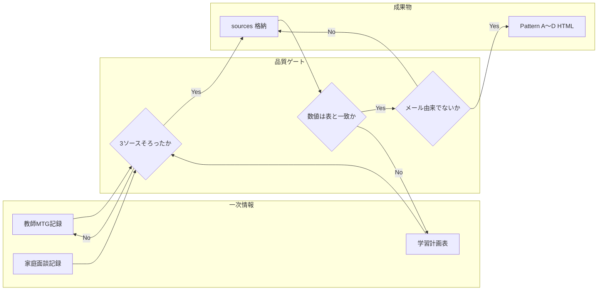

# 月次レポート生成ワークフロー（教師MTG・面談・学習計画表）

保護者向け月次レポートを、**メール文面に依存せず**、以下の一次情報のみを根拠として生成・レビューするための手順です。

## スコープ

| 含む | 含まない（品質担保のため別扱い） |
|------|----------------------------------|
| 教師ミーティング記録（要約・文字起こし） | 送付用メールのひな型・過去メール本文を**レポート本文の根拠にすること** |
| 家庭面談記録 | 未検証の推測・数値 |
| 学習計画表（スナップショット／エクスポート） | NotebookLM 単体の幻覚回答（ソース未指定の質問） |
| （任意）**対応メールの写し・リンク** — **レビュー・比較専用** | メール文を**品質比較の唯一の情報源**にすること |

**メール→レポート移行の受け入れ条件（例）:** レポートはメール本文を根拠にしないが、**旧メールと並べてレビュー**し、構造化・数値・追跡性・体裁がメールより優れていることを確認する。レビュー用メールは `sources/04_参照メール_レビュー用.md`（YAML フロントマター付き Markdown）のように別ファイル化するか、Gmail の閲覧専用リンクをレポートの **レビュー用セクション**（`#review-mail`）に載せる。

## 役割

| 役割 | 主な責務 |
|------|-----------|
| 担当教師 | MTG 記録の正確性、指導上の所見 |
| CA | 面談記録の整合、家庭合意事項の反映 |
| 作成者（人／AI） | 3ソースに基づくレポート草案、Pattern A〜D への落とし込み |
| 承認者 | 数値・日付・提案内容のファクトチェック |

## フロー（全体）



## フロー（ステップ）

1. **収集**  
   - 対象月の教師MTG要約、該当する家庭面談、**最新の**学習計画表スナップショット（基準日付き）を取得する。  
   - ファイル名例: `01_教師MTG_YYYYMMDD.md`, `02_家庭面談_YYYYMMDD.md`, `03_学習計画表_YYYYMMDD.md`（先頭に YAML でメタデータを置く）  
   - **優先順位:** レポートに載せる **数値・目標・不足コマ等の「正」** は **`03_学習計画表`（最新スナップショット）** とする。`01` の過去MTGは **時系列・経緯の参考** とし、日付が古い数値と食い違う場合は **03 を採用**する。

2. **格納**  
   - 生徒（家庭）単位フォルダに `sources/` として保存する（例: `samples/reports/demo_household_takafuji/sources/`）。

3. **整合チェック（必須）**  
   - 目標スコア・見立て・残り週数・不足コマ・ボトルネック単元は **学習計画表の記載と一致**させる。  
   - 教師MTG・面談の文言と矛盾がないか確認する。

4. **レポート草案**  
   - KPI・表・本文は **sources にある事実のみ**を起点とする（**最新月の出力**は **03** と対象月に近い `02` を中心に、**01** は補足の時系列として使う）。  
   - グラフの長期系列などソースにない指標は **「デモ／推定」明示**するか、省略する。

5. **Pattern 適用**  
   - Pattern A（レスポンシブ）／B（印刷向け）／C（軽量）／D（ダッシュボード）のいずれかに整形する。  
   - テンプレに残るダミー（架空住所・認証コード例・候補日のプレースホルダ）は **本番前に差し替えまたは削除**する。  
   - **ファクトチェック表（任意・推奨）:** レポート下部に「記載 ↔ 根拠ソース ↔ 照合ステータス（照合済／デモ／テンプレ／要確認）」を置く（`#factcheck`）。  
   - **グラフ要件の説明（任意・推奨）:** 折れ線・棒グラフに必要な一次情報の定義をレポート内に記載する（`#graph-requirements`）。  
   - **参照一覧（任意・推奨）:** `sources/` および `docs/` への相対パス、または **Google スプレッドシート等の URL** を表で明示する（`#references`）。実装例: `samples/reports/demo_household_takafuji/pattern_a_responsive.html`（ローカル相対リンクはプロジェクトルートを HTTP で配信するとき有効）。

6. **レビュー**  
   - 承認者が「根拠箇所（どのソースの何行相当か）」を追える状態にしてから確定する。ファクトチェック表がある場合は、そこを起点に突合する。  
   - **メール移行のレビュー:** 該当月の**対応メール**（レビュー用）をレポート近くに参照可能にし、**レポートの方がメールより品質基準を満たすか**（網羅性・数値・読みやすさ）をチェックする。メールは本文根拠に含めない。

6b. **レビュー用ビュー（Pattern A デモ）**  
   - `samples/reports/demo_household_takafuji/pattern_a_responsive.html` の **`#review-mail`** に、対応メールの **iframe 表示** および **テキストファイルへのリンク** を用意する例がある。保護者配布用には本ブロックを削除するか別URLに分離する。

## 参照の形式（ローカルパスとスプレッドシート URL）

レポート下部の「参照一覧」には、次のいずれか（併用可）を載せられます。

| 形式 | 用途例 | 注意 |
|------|--------|------|
| リポジトリ内の相対パス | `sources/*.txt`、`docs/*.md` | ローカルサーバーまたはファイル配置が分かる環境向け。 |
| **Google スプレッドシートの URL** | 学習計画表・成績ログ・グラフ用の数値シート | 閲覧者が開けるよう **共有設定**（閲覧者に共有、または組織内）を合わせる。特定シートなら URL に `gid=` を含める。 |

- **本番の個人情報・未公開URLを Git にコミットしない**運用にする場合、HTML には「社内ポータル経由のリンク」や、ビルド時に環境変数で差し込む URL を使う方法もある。  
- 保護者向けに配布する HTML に **編集権限付きの共有リンク** を載せない（原則は閲覧のみ、または別チャネルで案内）。

## ローカルプレビュー（`.txt` の文字化け対策）

Windows + Chrome で **`python -m http.server`** だけ使うと、`.txt` 応答に **`charset=utf-8` が付かず**日本語が文字化けすることがあります。

- **推奨:** プロジェクトルートで次を実行する。

  ```bash
  python scripts/serve_project.py
  ```

  （ポート指定: `python scripts/serve_project.py 8765`）

- ブラウザで `http://127.0.0.1:8765/samples/reports/demo_household_takafuji/sources/01_教師MTG_20260217.txt` などを開き、文字化けが解消するか確認する。

## NotebookLM からスプレッドシート（および Docs）の URL を取り出す

**結論:** `notebook_get` のソース一覧には **URL が含まれません**（`id` と `title` のみ）。一方、MCP の **`source_list_drive`** は、Google Drive 連携のソースについて **`drive_doc_id`** と **`type`**（例: `google_docs`）を返します。これを使うと **ブラウザ用 URL を組み立て可能**です。

| 状況 | 取れるか |
|------|----------|
| NotebookLM に **Drive から追加**した Google ドキュメント／スプレッドシート | 多くの場合 **`drive_doc_id` あり** → `scripts/notebooklm_drive_urls.py` で `https://docs.google.com/...` に変換可能。 |
| **フォルダの URL** を「ウェブソース」として追加しただけ | API が **`drive_doc_id` を返さない**ことがあり、この方法では **シート直リンクを復元できない**。その場合は元の Drive／スプレッドシートを別途開いて URL をコピーする。 |

**手順（推奨）**

1. MCP で **`source_list_drive`** を `notebook_id` 指定で実行する。  
2. 返却 JSON 全体を `source_list_drive.json` などに保存する。  
3. 次を実行し、TSV（title / type / url）を得る。

   ```bash
   python scripts/notebooklm_drive_urls.py path/to/source_list_drive.json
   ```

4. スプレッドシートだけ抽出したい場合は、出力を `type` 列でフィルタする（`google_sheets` 等。CLI のバージョンによって表記が異なる場合あり）。

**URL の組み立て（スクリプトと同じ規則）**

- Docs: `https://docs.google.com/document/d/{drive_doc_id}/edit`  
- Sheets: `https://docs.google.com/spreadsheets/d/{drive_doc_id}/edit`  
- 特定シートを指すには、スプレッドシートを開いたあと URL の `gid=` を付けたリンクを手でコピーする。

## 参照実装（デモ）

- ソース＋Pattern A サンプル: `samples/reports/demo_household_takafuji/`  
  - アンカー: `#review-mail`（レビュー用・対応メール）· `#factcheck` · `#graph-requirements` · `#references`  
- 汎用テンプレ（未入力）: `src/reports/templates/pattern_a_responsive.html` ほか

## 改訂履歴

| 日付 | 内容 |
|------|------|
| 2026-04-09 | 初版（メール非依存・3ソース準拠を明文化） |
| 2026-04-09 | グラフ要件・参照一覧セクションとワークフロー追記 |
| 2026-04-09 | 参照一覧にスプレッドシート URL を載せる場合の注意を追記 |
| 2026-04-09 | NotebookLM の source_list_drive から URL 復元する手順と `scripts/notebooklm_drive_urls.py` を追記 |
| 2026-04-09 | メール→レポート移行のレビュー用 `#review-mail` と `sources/04_参照メール_レビュー用.txt` を追記 |
| 2026-04-09 | `scripts/serve_project.py`（UTF-8 静的配信）・最新スナップショット優先の明文化 |
