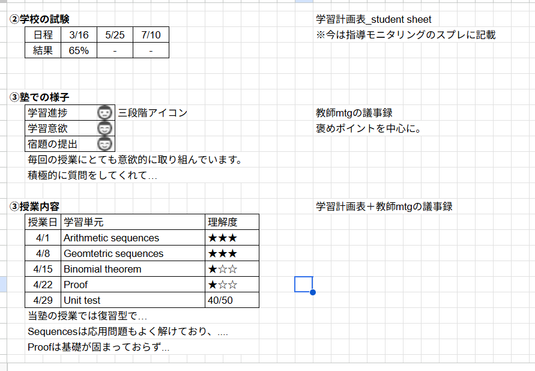
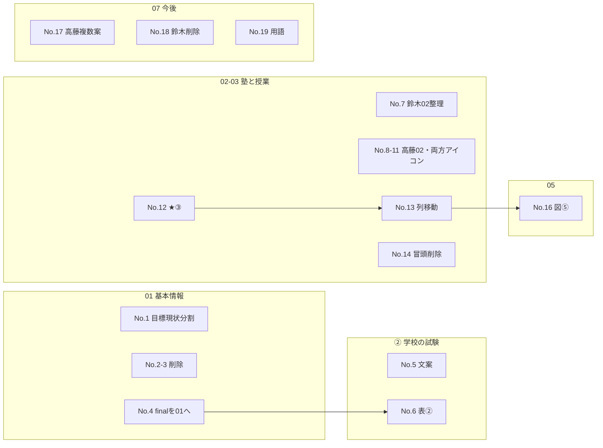

# 月次レポート（鈴木・高藤）ユーザーレビュー整理

**目的**: 配布前レビューで出た指摘を、**追跡・実装・再レビュー**できる形に固定する。  
**実装状況（2026-04-22）**: 指摘のうちレイアウト・本文の大部分を `monthly_2026-04_suzuki_report` / `takafuji_report` の **MD・HTML** および `monthly_pattern_b_content.template.md` に反映済み。手順とレビュー観点は [IMPLEMENTATION_STEPS_月次レビュー対応.md](IMPLEMENTATION_STEPS_月次レビュー対応.md) を参照。

**対象ファイル（現行の配布用 HTML 正本）**

| 生徒 | 主たる MD / HTML |
|------|------------------|
| 鈴木 謙吾 | `monthly_2026-04_suzuki_report.md` / `.html` |
| 高藤 泰次郎 | `monthly_2026-04_takafuji_report.md` / `.html` |

**参照図表**（レビュー表記「②③⑤」）：イメージ資料をリポジトリに格納済み。

| 参照 | ファイル |
|------|----------|
| ②③⑤ レイアウト正本（1枚） | [assets/review_layout_02_03_05_reference.png](assets/review_layout_02_03_05_reference.png) |

---

## 0. 参照レイアウト仕様（②③⑤）

以下は上記画像から読み取った**実装要件**（現行レポート採番では **02（塾での様子）・03（授業内容）・05** へのマッピング。**03a / 03b は廃止**）。

### ② 学校の試験（→ テンプレでは **01 集約**または独立した「学校の試験」表）

| 要素 | 内容 |
|------|------|
| 形式 | **コンパクトな表**（少なくとも「日程」行と「結果」行）。例：日程に 3/16・5/25・7/10 等、結果に 65%・「-」等。 |
| データソース（画像注記） | **学習計画表 `student` シート**、および **指導モニタリング用スプレッドシート**に現状記載ありとの注記。 |
| 実装メモ | 試験名／科目・範囲の列を足すかはデータに合わせてよいが、**「日付＋成績（または未実施）」が一覧でわかる**ことを優先（No.6）。 |

### ③ 塾での様子（→ レポート **02 塾での様子**）

| 要素 | 内容 |
|------|------|
| 形式 | **3行の評価表**＋その下に**短いコメント文**（褒め中心）。 |
| 行ラベル（例） | **学習進捗**／**学習意欲**／**宿題の提出** |
| 視覚 | 各行に **三段階の顔アイコン**（画像注記：「三段階アイコン」。良い・中立・要支援の区別）。 |
| データソース（画像注記） | **教師 MTG の議事録**。「褒めポイントを中心に。」 |
| 実装メモ | No.11 の「学習意欲などのアイコン」は **★ではなく顔アイコン**が正本。HTML では Unicode（🙂😐🙁 等）または SVG／CSS で再現。 |

### ③ 授業内容（→ レポート **03 授業内容**）

| 要素 | 内容 |
|------|------|
| 形式 | **表：列は「授業日」「学習単元」「理解度」**＋必要に応じて本文エリア。 |
| 学習単元 | **英語の公式トピック名**（例：Arithmetic sequences, Geometric sequences, Binomial theorem, Proof, Unit test）。 |
| 理解度 | **星三段階**（★★★／★★☆ 等）。テスト行は **点数表記**（例：40/50）でも可。 |
| データソース（画像注記） | **学習計画表 ＋ 教師 MTG 議事録**。 |
| 実装メモ | No.12 の★は **本ブロック（03）** に置く。No.13 どおり「学校／当塾の進み」列は **ここでは持たず 05 へ**。 |

### ⑤ 学習の進捗（→ レポート `05`）

提供画像の**主に写っているのは ② と ③（2種）**である。⑤は同じ資料の流れで「**学校の進捗と当塾の進捗を並べて比較できるビジュアル**」とレビューで指示されている（No.16）。

| 要素 | 内容 |
|------|------|
| 形式 | ②③と**トーンを揃えた**表または簡易チャート（例：トピック／学校／当塾の二列、達成率バー、レーン図など）。 |
| データ | 学習計画表の進捗列を **05 に集約**（No.13・16）。 |
| 実装メモ | 画像に⑤の完成例が写っていない場合は、**②③と同じ線の太さ・余白・フォント**でワイヤーを起こし、追って画像差し替え。 |

---

## 1. サマリー（種類別）

| 修正種類 | 件数（ユニーク指摘） | 備考 |
|----------|----------------------|------|
| 追加 | 3 | No.1, 11, 12（★表記） |
| 削除 | 6 | 言語・在籍校・重複記述・誤記・社内用語の整理 |
| 修正 | 12 | 表現・構造・数値・セクション間の役割分担 |

**横断テーマ**

- **01 基本情報**: スコア表記の分割、不要行の削除、試験時期の配置（鈴木・②連動）。
- **② 学校の試験**: 本文から**表（日程＋成績）**へ寄せる（No.6）。高藤 No.5 は**保護者向け文面**としての言い換え要検討。
- **02 塾での様子 / 03 授業内容 / 05**: 進捗列の**所在**を変える（No.13 → No.16）。**03** 冒頭文削除（No.14）。理解度★は **03**（No.12）。
- **07 今後の授業計画**: 社内用語排除（高藤 No.19）、誤記削除（鈴木 No.18）、複数案の載せ方（高藤 No.17）。

---

## 2. 指摘一覧（トレーサビリティ表）

| No. | 生徒 | 種類 | セクション | 項目 | 修正内容（原文要約） | 実装・文案の方針 |
|-----|------|------|------------|------|----------------------|------------------|
| 1 | 両方 | 追加 | 01 基本情報 | IB スコア | 目標と現状を**分けて**記載 | 例：「目標」「現状」を別行または別セル。鈴木は mid 等の表記と整合。 |
| 2 | 両方 | 削除 | 01 基本情報 | 指導言語 | 記載不要 | 表から行削除。MD/HTML/`sources` の表記ゆれも確認。 |
| 3 | 両方 | 削除 | 01 基本情報 | 在籍校 | 記載不要 | 同上。 |
| 4 | 鈴木 | 修正 | ② 学校の試験 | final exam | 時期は**一番上の基本情報**に記載 | **学校の試験**ブロックから final の日付表現を 01 へ移し、試験表は日程・成績に寄せる（No.6 と整合）。 |
| 5 | 高藤 | 修正 | ② 学校の試験 | 答案原本の文 | 「得点の数字は、配布前に答案原本で必ずご確認ください。」とは？ | **意図**: 自動要約ベースの数値をそのまま家庭に出さない注意。**課題**: 保護者には「答案原本」は伝わりにくく、社内オペに見える。**方針案**: (A) 削除し裏でチェックリストのみに回す、(B)「学校返却の答案で数値をご確認ください」等に言い換え、(C) 確定数値のみ本文に書き「未確定の場合は追ってご連絡」とする。 |
| 6 | 両方 | 修正 | ② 学校の試験 | 表形式 | **日程と成績**を表で記載。**②学校の試験**を参照 | 現状の散文＋一部数値を、**列：試験名／日程／科目または範囲／得点・評価／備考** 等に整理。②の図を正とする。 |
| 7 | 鈴木 | 削除 | 02 塾での様子 | 3月の授業内容 | **03** に書いているので **02** では不要 | **02** の「月の主な流れ」等、**03** の表と重複する箇所を削除。 |
| 8 | 高藤 | 修正 | 02 塾での様子 | 構成 | **良い点**と**計画方針**が混在 | 見出しまたは段落で二分（例：「ここが良い」「今後の方針」）。 |
| 9 | 高藤 | 修正 | 02 塾での様子 | 単元名 | **アルファベット表記に統一**（例：三角比 → Trigonometry） | **02** および必要なら **03** の本文中の和名を英語公式トピック名に揃える。 |
| 10 | 鈴木 | 修正 | 02 塾での様子 | 授業時間 | 「30分×…合計1時間30分」は**誤り**。実態は **75 分** | 計画表・運用の正しい分数に修正。表記ゆれ防止のため `sources` に根拠行を明記。 |
| 11 | 両方 | 修正 | 02 塾での様子 | 学習意欲など | **三段階アイコン**がない | **参照レイアウト 0章**：**顔アイコン**三档（学習進捗・意欲・宿題提出の各行）。**03** の理解度★とは別デザイン。 |
| 12 | 両方 | 追加 | 03 授業内容 | 理解度 | **★で表記**。**③授業内容**を参照 | **03** の表または列として「理解度」を追加。データソースが学習計画表にない場合は、**空欄／「授業内観察」**と明記するか要方針決定。 |
| 13 | 両方 | 追加 | 03 授業内容 | 進捗列 | **学校での進み・当塾の進みは 03 から削除**し、**05 学習の進捗**の表に反映 | **03** は「日付・単元・理解度・メモ」等に特化。進捗比較は 05 に集約。 |
| 14 | 両方 | 修正 | 03 授業内容 | 冒頭文 | 「下表は、学習計画表に沿った…」**を削除**（高藤文面の該当文。鈴木側も同種があれば統一） | 表は見出し直下に配置。必要なら短いキャプションのみ。 |
| 16 | 両方 | 修正 | 05 学習の進捗 | 学校比較 | 学校との比較ができない → **学校の進捗を 05 で図示**。**⑤学習の進捗**を参照 | 棒・レーン、二列比較表、Gantt 簡易版等、**⑤の案に合わせる**。No.13 と同一データの単一情報源にする。 |
| 17 | 高藤 | 修正 | 07 今後の授業計画 | 複数案 | 「複数パターンをご家庭に送る」ではなく、**この月次レポート本文に複数パターンを記載** | CA 送付文面ではなく、レポート内に案 A/B（日程・重点の違い）を明示。 |
| 18 | 鈴木 | 削除 | 07 今後の授業計画 | 予約枠 | 「森田先生より…**2時間分の予約枠**…」は**誤り** | 該当箇所削除。正しい予約ルールが分かり次第 1 文に差し替え。 |
| 19 | 高藤 | 修正 | 07 今後の授業計画 | 社内用語 | 「**教師MTG**」等は家庭向けに不要 | 「担当間で共有済み」程度に一般化、または削除。`sources` には MTG 参照を残してよい。 |

※ 元表で **No.15 が欠番**のため本表も欠番に合わせていない（16 のまま）。

---

## 3. 依存関係・実装順の提案

1. **01（No.1〜4）** → **② 学校の試験**の表の列定義に合わせて final の置き場所を固定。  
2. **② 学校の試験（No.5,6）** → 表テンプレ確定後、両名のデータを埋める。  
3. **03（No.12〜14）** → 列構成変更後に **05（No.16）** へ進捗を移す。  
4. **02（No.7〜11）** → 重複削除・時間修正・高藤の構成・英語表記。  
5. **07（No.17〜19,18）** → 最後に家庭向けトーンで統一。

---

## 4. No.5 への回答文案（ドキュメント用）

レビュー質問「『得点の数字は、配布前に答案原本で必ずご確認ください。』とは？」に対する**説明**：

- **背景**: 当該段落は、教師 MTG の自動要約に含まれる得点が、**音声・答案と一致しているか未検証**であることを示すための**管理者向け注意**を、誤ってご家庭向け本文に混ぜた形に近い。  
- **保護者向けとしての問題**: 「答案原本」は家庭内で必ずしも手元にあるとは限らず、**何をすべきか不明**になりやすい。  
- **推奨**: ご家庭に出す文面では、(1) **確定した得点だけ**を書く、(2) 未確定なら **「詳細は次回以降お知らせします」** にする、(3) 社内確認事項は **管理者向けブロックまたは `sources` のみ**に限定する。

---

## 5. 次アクション（チェックリスト）

- [x] ②③⑤の参照画像を `assets/review_layout_02_03_05_reference.png` に格納し、本ファイルに埋め込み済み。  
- [ ] `monthly_pattern_b_content.template.md` / `monthly_pattern_b_template.html` に、上記方針を**ひな型レベル**で反映するか判断する。  
- [ ] 鈴木・高藤の **MD → HTML** を同順で更新し、`scripts/sync_monthly_reports_to_vercel.mjs` → Vercel 同期を行う。  
- [ ] 再レビュー依頼時は、本表の **No.** をチケット ID として返信する。

---

## 6. 変更履歴

| 日付 | 内容 |
|------|------|
| 2026-04-22 | 初版：ユーザーレビュー表を整理しドキュメント化。 |
| 2026-04-22 | ②③⑤イメージ画像を `assets/` に保存し、第0章でレイアウト仕様を記述。No.11 を顔アイコン正と明記。 |
| 2026-04-22 | レビュー対応を MD/HTML・ひな形に反映。実施ログ `IMPLEMENTATION_STEPS_月次レビュー対応.md`、再現性方針 `REPRODUCIBILITY_方針_月次レポート.md` を追加。 |
